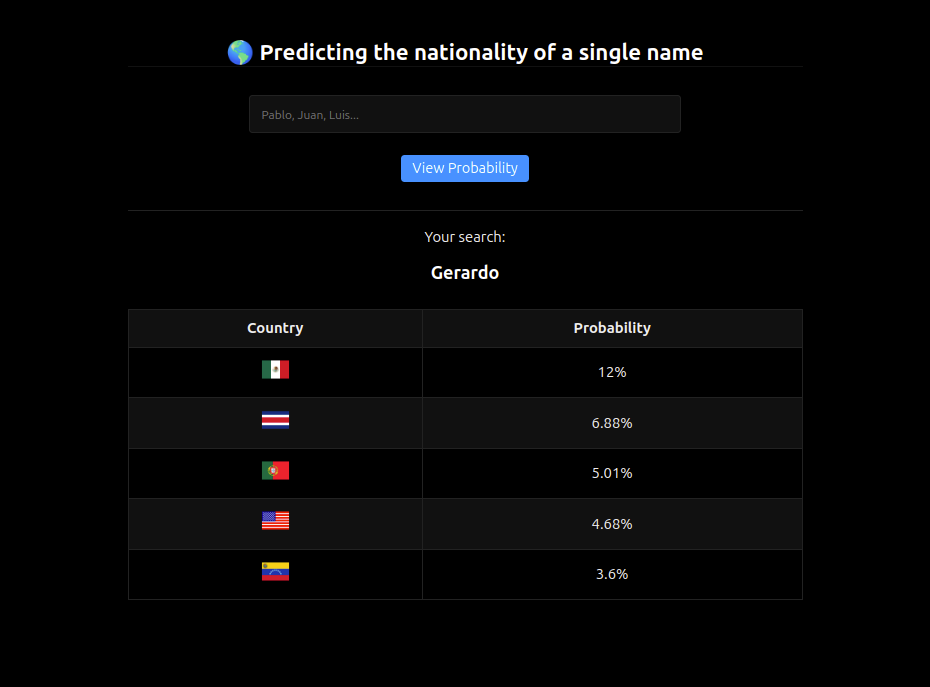

# Predicting the nationality of a single name 🌎

This project uses PHP and seeks to show basic concepts of data consumption and visualization through an API


## API Reference

https://nationalize.io/documentation#basic-usage


## Deployment

> You must have PHP installed

```bash
  php -S localhost:8090
```


## Screenshots



